<p align="center">
  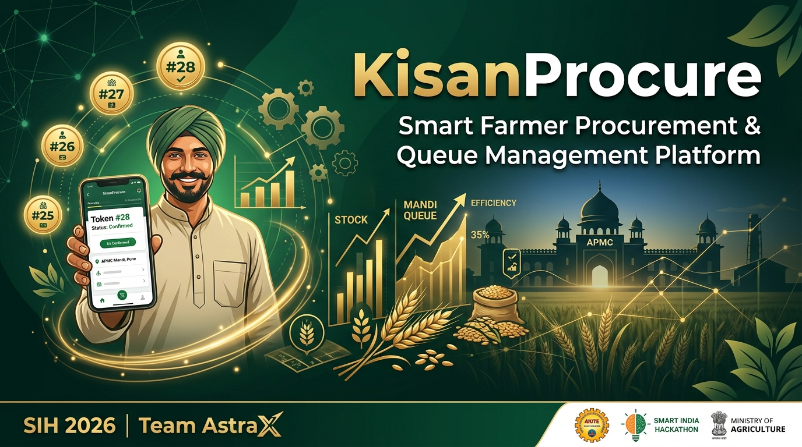
</p>

<h1 align="center">🌾 KisanProcure</h1>
<h3 align="center">Smart Farmer Procurement & Queue Management Platform</h3>

<p align="center">
  <strong>SIH 2026 — Problem Statement 26032 &nbsp;|&nbsp; Team AstraX</strong>
</p>

<p align="center">
  
  
  
  
  
  
</p>

<p align="center">
  
  
  
</p>

---

## 📋 Table of Contents

- [Overview](#-overview)
- [Problem Statement](#-problem-statement)
- [Solution](#-our-solution)
- [Impact Metrics](#-impact-metrics)
- [Application Preview](#-application-preview)
- [Complete Workflow](#-complete-farmer-workflow)
- [System Architecture](#-system-architecture)
- [Smart Queue Engine](#-smart-queue-engine)
- [Smart Slot Recommendation](#-smart-slot-recommendation)
- [Procurement Lifecycle](#-procurement-lifecycle)
- [Database Design](#-database-er-diagram)
- [User Roles](#-user-roles)
- [Key Features](#-key-features)
- [Technology Stack](#-technology-stack)
- [API Architecture](#-api-architecture)
- [Security](#-security)
- [Demo Scenario](#-demo-scenario)
- [Installation](#-installation--setup)
- [Team](#-team-astrax)

---

## 🚀 Overview

**KisanProcure** is a smart digital platform that transforms the traditional physical crop procurement experience into a planned, transparent, and digitally managed journey.

> **Instead of**: Farmer travels → Waits in queue → Uncertainty → Procurement → No visibility
>
> **KisanProcure**: Book → Token → Track Queue → Arrive → Procure → Track Payment

The platform connects **👨‍🌾 Farmers**, **🏢 Procurement Centre Operators**, and **🏛️ Government Administrators** on a single unified platform.

---

## ❓ Problem Statement

**SIH 2026 — PS 26032**

Indian farmers face critical challenges at government procurement centres (APMC Mandis):

| Problem | Impact |
|---------|--------|
| 🕐 Long waiting times (4–8 hours) | Productivity loss, physical hardship |
| 📍 No real-time queue information | Uncertainty, anxiety, repeated visits |
| 🚫 No advance slot booking | Farmers travel without guarantee |
| 💸 Opaque payment timelines | Financial uncertainty |
| 📵 Language & digital barriers | Exclusion of marginal farmers |
| 📋 Paper-based procurement | Errors, delays, no audit trail |

---

## 💡 Our Solution

KisanProcure answers **6 key questions** every farmer asks:

```
1. Where should I go?        → Smart Centre Recommendation
2. When should I go?         → Intelligent Slot Booking
3. What is my token?         → Digital Token Generation
4. How many ahead of me?     → Live Queue Tracking
5. What's happening?         → Real-time Procurement Tracking
6. When will I be paid?      → Payment Status Dashboard
```

---

## 📊 Impact Metrics

<p align="center">
  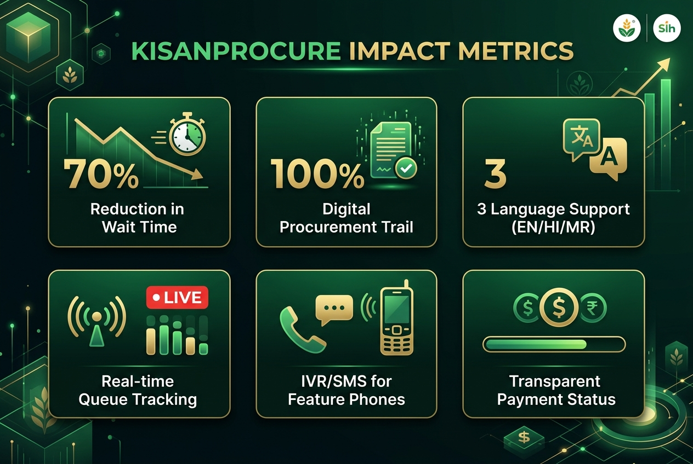
</p>

| Metric | Before KisanProcure | After KisanProcure |
|--------|--------------------|--------------------|
| Average wait time | 4–8 hours | < 30 minutes |
| Wasted farmer trips | ~40% of visits | Near zero |
| Procurement transparency | None | 100% digital trail |
| Payment visibility | Unknown | Real-time tracking |
| Language accessibility | Hindi only | English + Hindi + Marathi |
| Feature phone access | None | IVR + SMS support |

---

## 📱 Application Preview

> 📸 **Note:** Replace placeholder images below with actual screenshots from the running application at `http://localhost:5173`

<p align="center">
  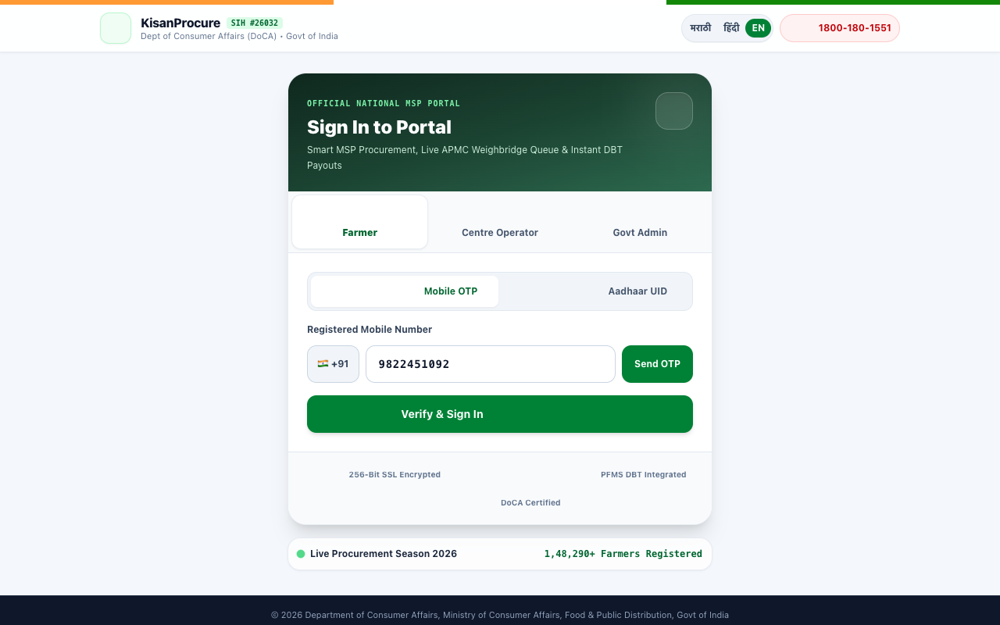
  
  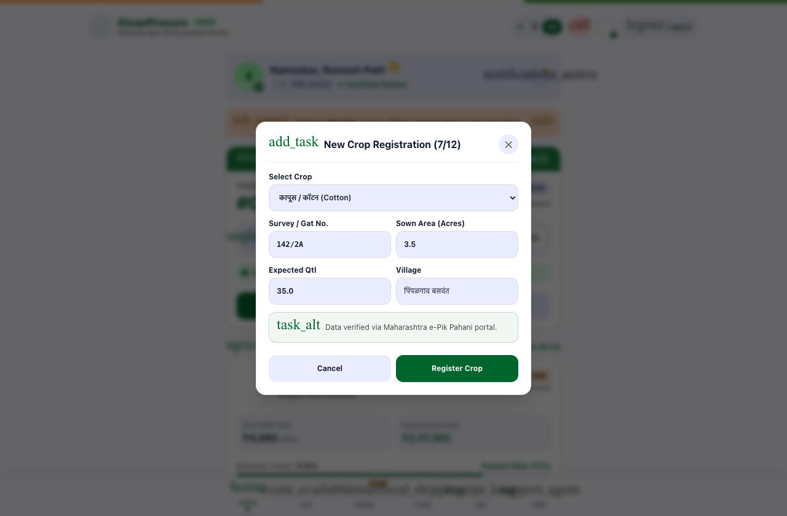
</p>

<p align="center">
  <em>Login Screen &nbsp;&nbsp;|&nbsp;&nbsp; Farmer Home Dashboard &nbsp;&nbsp;|&nbsp;&nbsp; Crop Registration</em>
</p>

<p align="center">
  
  
  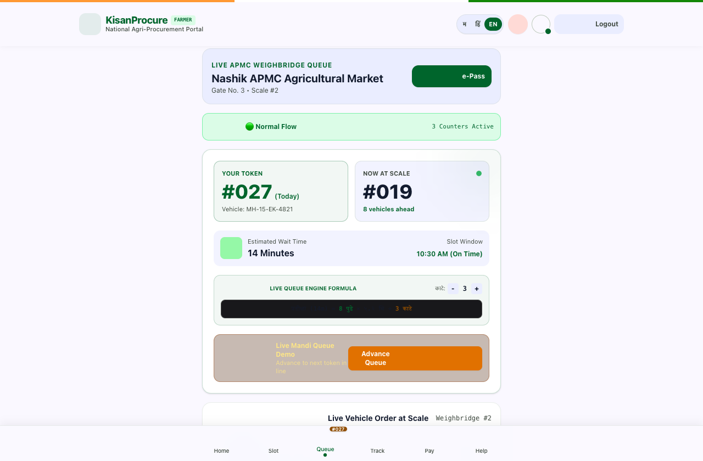
</p>

<p align="center">
  <em>Smart Slot Booking &nbsp;&nbsp;|&nbsp;&nbsp; Digital Token &nbsp;&nbsp;|&nbsp;&nbsp; Live Queue Tracking</em>
</p>

<p align="center">
  
  
  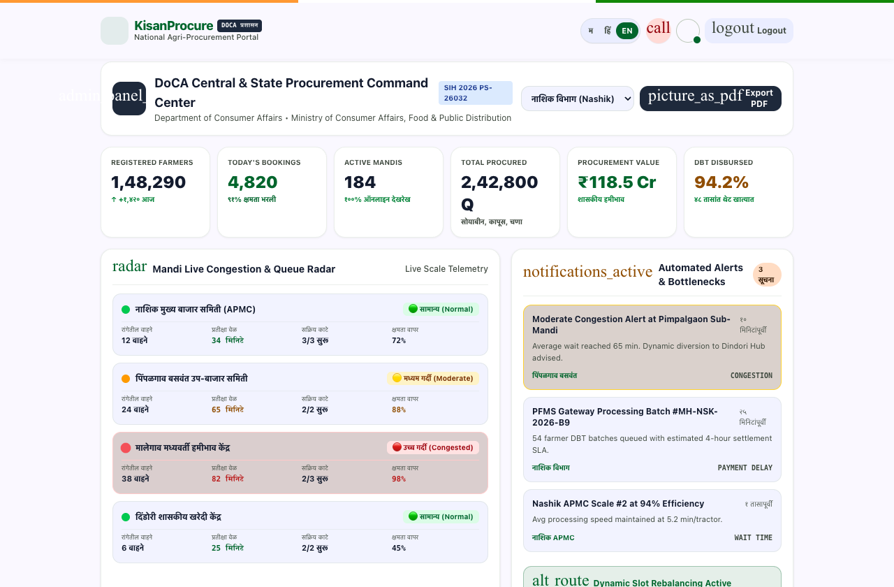
</p>

<p align="center">
  <em>Procurement Tracking &nbsp;&nbsp;|&nbsp;&nbsp; Payment Status &nbsp;&nbsp;|&nbsp;&nbsp; Government Admin Dashboard</em>
</p>

<p align="center">
  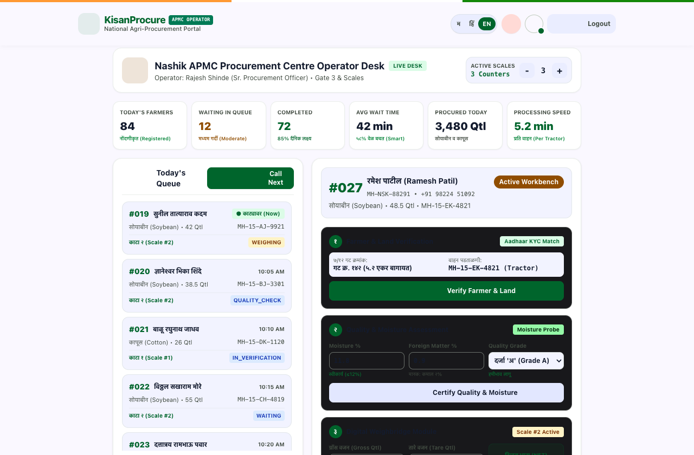
  
</p>

<p align="center">
  <em>Centre Operator Dashboard &nbsp;&nbsp;|&nbsp;&nbsp; Grievance Management</em>
</p>

---

## 🗺️ Complete Farmer Workflow


---

## 🏗️ System Architecture

<p align="center">
  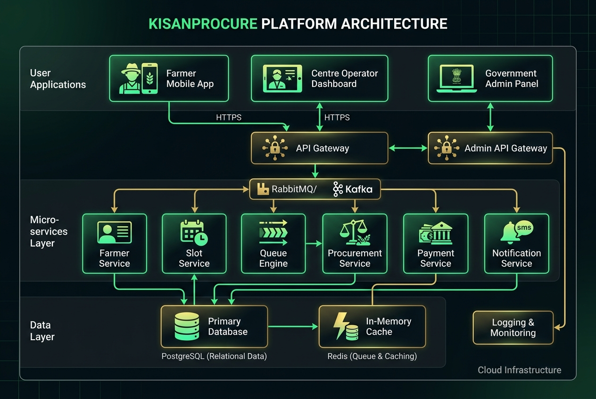
</p>

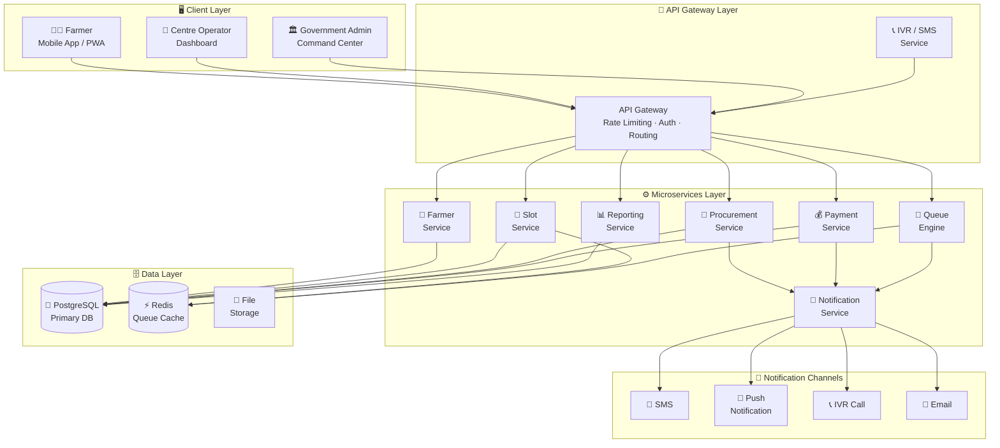

---

## 🔄 Smart Queue Engine

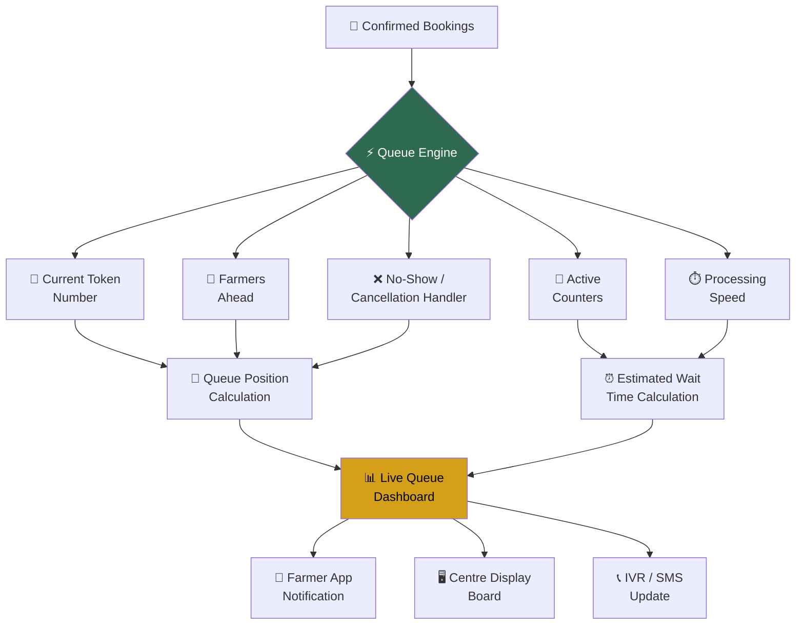

---

## 🤖 Smart Slot Recommendation

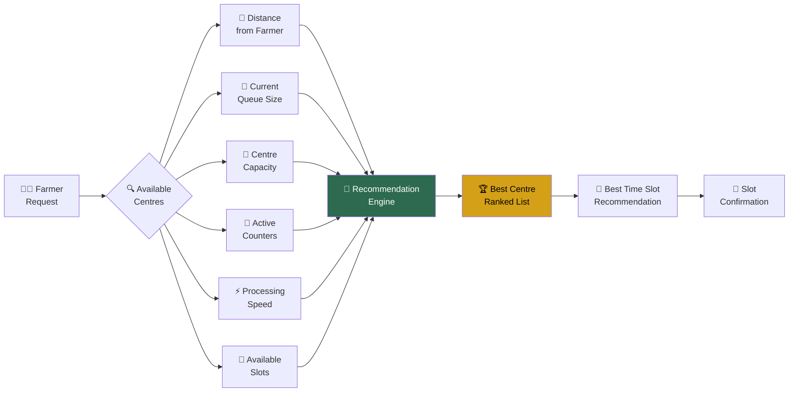

---

## 📦 Procurement Lifecycle

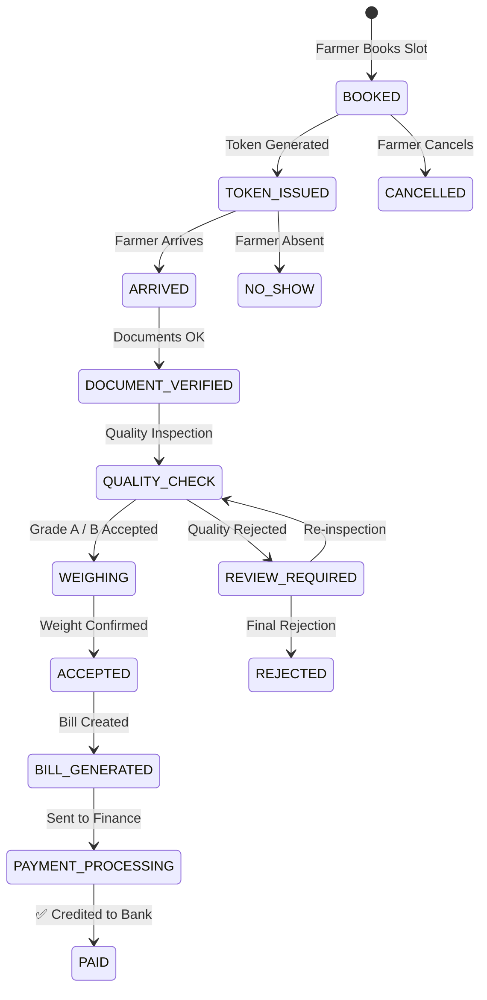

---

## 🗃️ Database ER Diagram

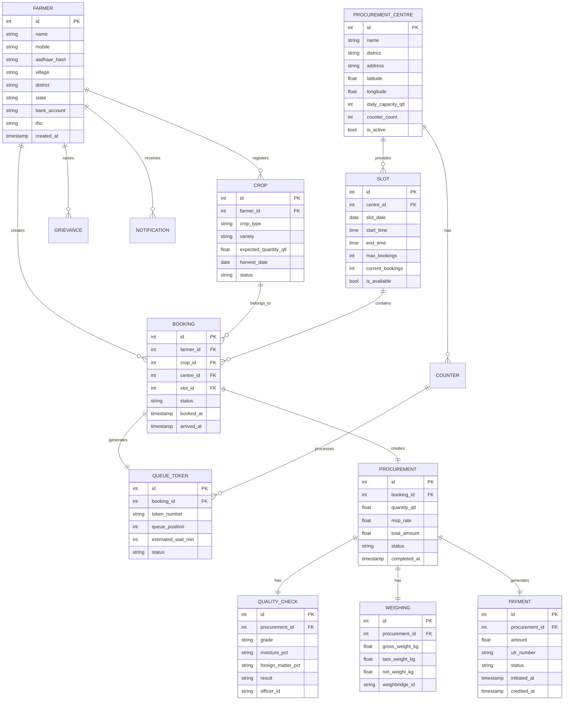

---

## 👥 User Roles

<p align="center">
  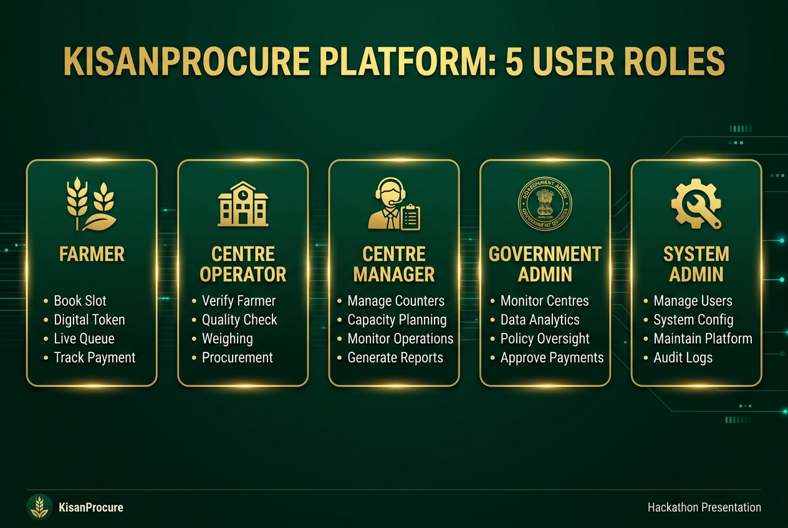
</p>

```mermaid
flowchart TB
    A[🌾 KisanProcure Platform]

    A --> B[👨‍🌾 Farmer]
    A --> C[👷 Centre Operator]
    A --> D[🏢 Centre Manager]
    A --> E[🏛️ Government Admin]
    A --> F[⚙️ System Admin]

    B --> B1[📅 Book Slot]
    B --> B2[🎫 Digital Token]
    B --> B3[📊 Live Queue]
    B --> B4[💰 Track Payment]
    B --> B5[📋 Grievance]

    C --> C1[✅ Verify Farmer]
    C --> C2[🔬 Quality Check]
    C --> C3[⚖️ Weighing]
    C --> C4[📄 Procurement Entry]

    D --> D1[🏪 Manage Counters]
    D --> D2[📊 Centre Capacity]
    D --> D3[📈 Centre Reports]
    D --> D4[👥 Staff Management]

    E --> E1[🗺️ Monitor All Centres]
    E --> E2[📊 Analytics Dashboard]
    E --> E3[💸 Payment Oversight]
    E --> E4[📋 Policy Configuration]

    F --> F1[👤 User Management]
    F --> F2[⚙️ System Config]
    F --> F3[🔍 Audit Logs]
    F --> F4[🔐 Security]
```

---

## ✨ Key Features

### 👨‍🌾 Farmer Portal
| Feature | Description |
|---------|-------------|
| 📱 **Smart Registration** | Mobile + Aadhaar based digital onboarding |
| 🌾 **Crop Registration** | Register crop type, variety, estimated quantity |
| 🤖 **Smart Slot Recommendation** | AI-ranked centre & slot suggestions |
| 📅 **Slot Booking** | Book time slots to avoid long waits |
| 🎫 **Digital Token** | QR-code based gate pass |
| 📊 **Live Queue** | Real-time position & estimated wait time |
| 🗺️ **Mandi Finder** | Nearby procurement centre map |
| 📦 **Procurement Tracking** | Step-by-step status from arrival to payment |
| 💰 **Payment Dashboard** | Amount, UTR, expected credit date |
| 📋 **Grievance System** | Submit and track complaints |
| 🎙️ **Voice Assistant** | Hands-free navigation (EN/HI/MR) |
| 📞 **IVR / SMS Access** | For non-smartphone farmers |

### 🏢 Centre Operator Dashboard
| Feature | Description |
|---------|-------------|
| 🚪 **Gate Management** | Token scanning, farmer arrival confirmation |
| 📋 **Document Verification** | Aadhaar, land records check |
| 🔬 **Quality Check** | Grade A/B assessment, result recording |
| ⚖️ **Weighing Module** | Weighbridge integration, net weight calculation |
| 📄 **Bill Generation** | MSP × Net Weight auto-calculation |
| 🖥️ **Queue Display** | Live queue status for centre boards |

### 🏛️ Government Admin Command Center
| Feature | Description |
|---------|-------------|
| 🗺️ **Live Map Dashboard** | All centres, congestion, real-time status |
| 📊 **Analytics & Reports** | Procurement volume, payment trends |
| 💸 **Payment Monitoring** | Pending, processed, disbursed amounts |
| ⚙️ **Policy Controls** | MSP rates, slot capacity, holiday calendar |
| 📋 **Audit Log** | Complete immutable audit trail |
| 🔔 **Alert System** | Congestion, anomaly, fraud alerts |

---

## 🛠️ Technology Stack

<p align="center">
  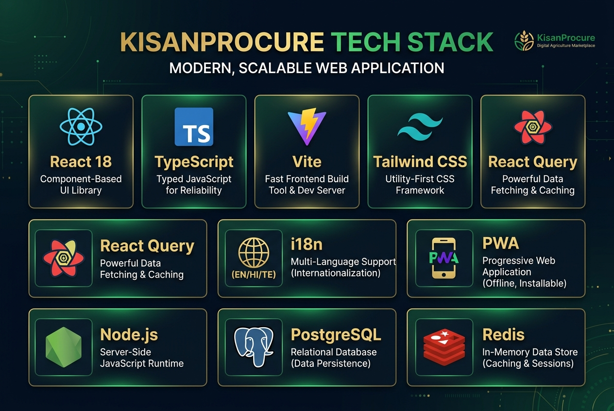
</p>

### Frontend
| Technology | Version | Purpose |
|-----------|---------|---------|
| **React** | 18.x | UI Component Library |
| **TypeScript** | 5.x | Type-safe JavaScript |
| **Vite** | 5.x | Build Tool & Dev Server |
| **Tailwind CSS** | 3.x | Utility-first Styling |
| **i18n** | Custom | EN/HI/MR Translations |
| **PWA** | - | Installable, Offline-capable |

### Backend (Production Architecture)
| Technology | Purpose |
|-----------|---------|
| **Node.js + Express** | REST API Server |
| **PostgreSQL** | Primary Relational Database |
| **Redis** | Queue Cache & Session Storage |
| **JWT + OTP** | Authentication |
| **Firebase Cloud Messaging** | Push Notifications |
| **Twilio** | SMS & IVR Services |

### Infrastructure
| Technology | Purpose |
|-----------|---------|
| **Docker** | Containerization |
| **Nginx** | Reverse Proxy |
| **AWS / GCP** | Cloud Hosting |
| **GitHub Actions** | CI/CD Pipeline |

---

## 🔌 API Architecture

```mermaid
flowchart LR
    subgraph CLIENT
        APP[React PWA]
    end

    subgraph GATEWAY
        GW[API Gateway\n/api/v1]
        AUTH[JWT Auth\nMiddleware]
    end

    subgraph ENDPOINTS
        F[/farmers]
        S[/slots]
        B[/bookings]
        Q[/queue]
        P[/procurement]
        PAY[/payments]
        N[/notifications]
        G[/grievances]
        R[/reports]
    end

    APP -->|HTTPS| GW
    GW --> AUTH
    AUTH --> F
    AUTH --> S
    AUTH --> B
    AUTH --> Q
    AUTH --> P
    AUTH --> PAY
    AUTH --> N
    AUTH --> G
    AUTH --> R
```

### Key API Endpoints

```
POST   /api/v1/auth/register           → Farmer registration
POST   /api/v1/auth/login              → OTP-based login
GET    /api/v1/centres                 → List procurement centres
GET    /api/v1/centres/:id/slots       → Get available slots
POST   /api/v1/bookings                → Book a slot
GET    /api/v1/bookings/:id/token      → Get digital token
GET    /api/v1/queue/:centreId/live    → Live queue status
POST   /api/v1/procurement/:id/quality → Record quality check
POST   /api/v1/procurement/:id/weigh   → Record weighing
GET    /api/v1/payments/:farmerId      → Payment history
POST   /api/v1/grievances              → Submit grievance
GET    /api/v1/admin/analytics         → Admin analytics
```

---

## 🔐 Security

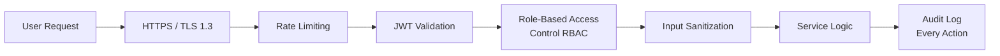

| Security Layer | Implementation |
|---------------|---------------|
| 🔒 **Transport** | HTTPS + TLS 1.3 |
| 🎟️ **Authentication** | JWT + OTP (Mobile Verified) |
| 🛡️ **Authorization** | Role-Based Access Control (RBAC) |
| 🔐 **Data** | Aadhaar stored as salted hash only |
| 📝 **Audit** | Immutable audit log for every action |
| 🚦 **Rate Limiting** | Per-IP and per-user limits |
| 🔍 **Input Validation** | Sanitized at gateway level |

---

## 🎬 Demo Scenario

> **Farmer Suresh Kumar, Village Nashik, Maharashtra**

```
Day 1 — Registration
✅ Suresh registers on KisanProcure via mobile
✅ Registers 50 quintals of Wheat (Lok 1 variety)
✅ System recommends Nashik APMC Centre

Day 2 — Booking
✅ Suresh selects slot: 10 AM – 12 PM, Friday
✅ Receives Token #KP-2026-0847 via SMS
✅ Queue position: 12 | Estimated wait: 24 minutes

Friday Morning
✅ Suresh arrives at 10:15 AM
✅ Document verification: PASS
✅ Quality Check: Grade A (Moisture 12.5%)
✅ Weighing: 48.6 quintals net
✅ Amount: ₹1,06,920 (@ MSP ₹2,200/qtl)
✅ Bill generated: KP-BILL-2026-0847

Following Tuesday
✅ Payment credited: ₹1,06,920 to SBI account
✅ UTR: SBIN0000847265
✅ SMS + App notification received
```

**Total time at centre: 45 minutes (vs. 4–8 hours earlier)**

---

## 🔁 Procurement Tracking Flow


---

## ⚡ Installation & Setup

### Prerequisites
- Node.js 18+
- npm or bun

### Quick Start

```bash
# Clone repository
git clone https://github.com/iparayush/KISAN-MARKET-BOOK-.git
cd KISAN-MARKET-BOOK-

# Install dependencies
npm install

# Start development server
npm run dev
```

Open **http://localhost:5173** in your browser.

### Demo Login Credentials

| Role | Mobile | OTP |
|------|--------|-----|
| 👨‍🌾 Farmer | Any mobile number | `1234` |
| 🏢 Centre Operator | Switch via banner | — |
| 🏛️ Govt Admin | Switch via banner | — |

> Use the **Role Switch Banner** at the top to navigate between Farmer, Operator, and Admin views.

### Build for Production

```bash
npm run build
npm run preview
```

### Environment Variables

```bash
# Copy example env file
cp .env.example .env
```

```env
VITE_APP_NAME=KisanProcure
VITE_APP_VERSION=1.0.0
VITE_API_BASE_URL=http://localhost:3001/api/v1
VITE_MAPS_API_KEY=your_maps_api_key
VITE_FCM_KEY=your_firebase_key
```

---

## 📁 Project Structure

```
kisanprocure/
├── src/
│   ├── components/
│   │   ├── HomeScreen.tsx              # Farmer home dashboard
│   │   ├── LoginScreen.tsx             # Auth screen
│   │   ├── BookSlotScreen.tsx          # Slot booking flow
│   │   ├── LiveQueueScreen.tsx         # Real-time queue
│   │   ├── TrackingScreen.tsx          # Procurement tracking
│   │   ├── PaymentsScreen.tsx          # Payment dashboard
│   │   ├── GrievanceScreen.tsx         # Grievance portal
│   │   ├── CentreOperatorDashboard.tsx # Operator view
│   │   ├── AdminDashboard.tsx          # Govt admin view
│   │   ├── IvrSmsModal.tsx             # IVR/SMS simulator
│   │   ├── VoiceAssistToast.tsx        # Voice assistant
│   │   ├── MandiFinderModal.tsx        # Map/mandi finder
│   │   ├── WeatherModal.tsx            # Weather info
│   │   └── ...                         # Other components
│   ├── data/
│   │   └── mockData.ts                 # Demo data
│   ├── utils/
│   │   └── i18n.ts                     # Translations (EN/HI/MR)
│   ├── types.ts                        # TypeScript interfaces
│   ├── App.tsx                         # Root component
│   └── main.tsx                        # Entry point
├── docs/
│   └── images/                         # Project visuals
├── index.html
├── vite.config.ts
├── tsconfig.json
└── README.md
```

---

## 🌐 Accessibility & Inclusivity

| Feature | Description |
|---------|-------------|
| 🌍 **Trilingual** | English, हिन्दी, मराठी |
| 🎙️ **Voice Assistant** | Audio guidance in all 3 languages |
| 📞 **IVR System** | Feature phone support via phone call |
| 📱 **SMS Alerts** | Token, queue updates, payment info |
| 🌐 **PWA** | Works offline, installable on mobile |
| ♿ **Accessible UI** | High contrast, large text support |

---

## 👨‍💻 Team AstraX

**SIH 2026 — Smart India Hackathon**

| Member | Role |
|--------|------|
| Team Lead | Full Stack Architecture |
| Developer | React / TypeScript Frontend |
| Developer | Backend & API Design |
| Designer | UI/UX & Accessibility |
| Analyst | Data & Business Logic |
| Researcher | Domain & Agriculture Policy |

---

## 📄 License

This project is licensed under the **MIT License** — see the [LICENSE](LICENSE) file for details.

---

<p align="center">
  <strong>🌾 KisanProcure — Empowering Every Farmer, Every Harvest</strong>
  <br><br>
  Made with ❤️ by <strong>Team AstraX</strong> for <strong>SIH 2026</strong>
</p>

<p align="center">
  
</p>
