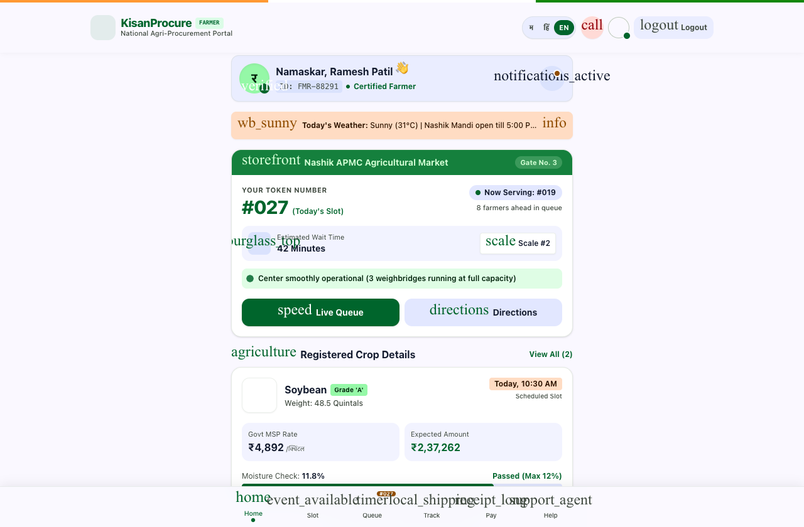
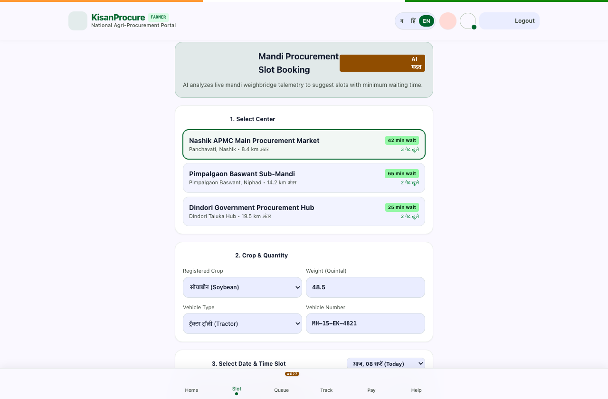
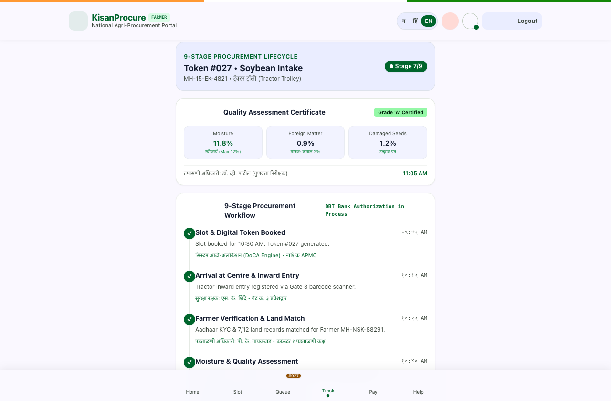
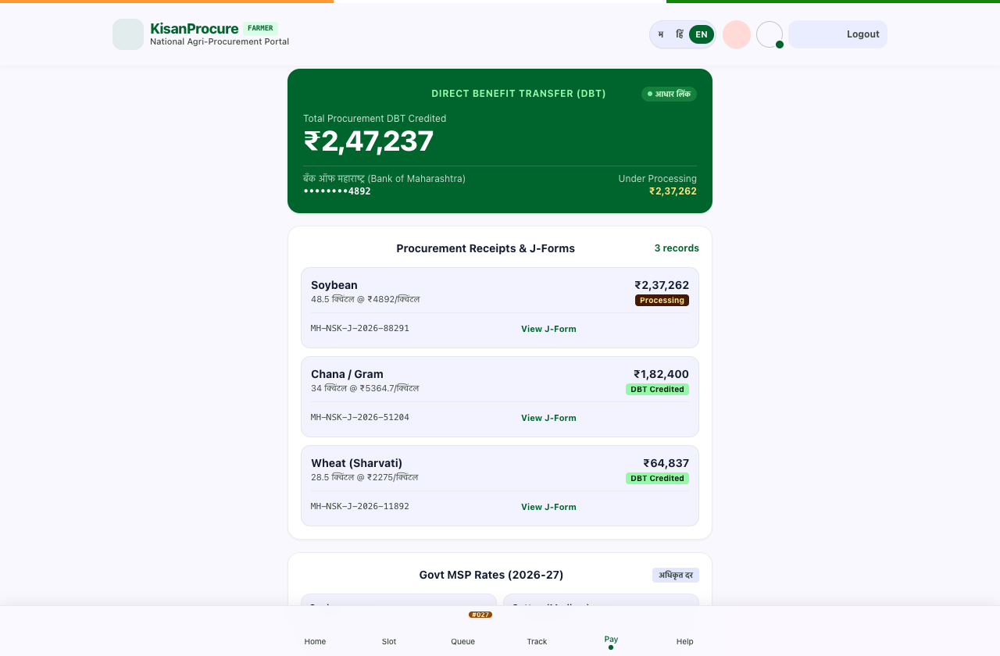

# 🌾 KisanProcure
### Smart Farmer Procurement Queue Management Platform
**SIH 2026 Problem Statement:** `SIH26032`  
**Team:** `_AstraX`  
**Tagline:** **BOOK SMART → WAIT LESS → TRACK EVERYTHING**

---

## 📌 Overview

Agricultural procurement in India often faces severe congestion and long waiting times at physical procurement centres (APMC Mandis and PACS). While existing systems such as **e-NAM** and **Kapas Kisan** digitize trade bidding and receipts, **KisanProcure** serves as a complementary **queue-management and centre-coordination layer** that seamlessly coordinates the physical arrival and verification workflow.

> **Note:** KisanProcure is designed to integrate with and augment existing government procurement portals (e-NAM, State MSP portals, PFMS) rather than replace them.

---

## 📸 Application Screenshots

### 👨‍🌾 Farmer App

| Feature | Screenshot | Description |
|---|---|---|
| **Farmer Registration & Login** |  | Secure multi-lingual OTP/Aadhaar authentication with 7/12 land record validation. |
| **Farmer Dashboard** |  | At-a-glance view of registered crops, active token status, and quick mandi actions. |
| **Crop Registration** |  | Pre-arrival declaration of crop type, quantity, moisture content, and vehicle info. |
| **Smart Centre & Slot Recommendation** |  | Workload-balanced slot and centre suggestions to minimize physical waiting times. |
| **Digital Token & Gate Pass** |  | QR/barcode digital pass for expedited inward security check-in at mandi gate. |
| **Live Queue Tracking** |  | Real-time queue monitor showing position ahead, active counters, and dynamic ETA. |
| **Procurement Tracking** |  | Transparent 8-stage progress tracker from arrival to mandi acceptance. |
| **Payment Tracking (DBT)** |  | Direct Benefit Transfer status, digital J-Form download, and bank UTR updates. |

### 🏢 Centre Dashboard

| Feature | Screenshot | Description |
|---|---|---|
| **Centre Dashboard** |  | Overview of daily intake, operator terminals, gate arrivals, and scale utilization. |
| **Live Queue Management** |  | Counter allocation and queue progression management across active weighbridges. |

### 🛠️ Admin Dashboard

| Feature | Screenshot | Description |
|---|---|---|
| **Admin Dashboard** |  | District/state-level monitoring of centre congestion, processing rates, and DBT payouts. |

---

## 🎥 Prototype Demo

🔗 **Live Prototype:** [https://kisan-market-book.vercel.app/](https://kisan-market-book.vercel.app/)

KisanProcure connects farmers, procurement centres and authorities through digital registration, smart slot recommendation, digital tokens, live queue tracking, procurement tracking and payment status.

---

## 🏗️ System Architecture

$$\text{REGISTER} \longrightarrow \text{CROP} \longrightarrow \text{SMART SLOT} \longrightarrow \text{TOKEN} \longrightarrow \text{LIVE QUEUE}$$
$$\longrightarrow \text{VERIFICATION} \longrightarrow \text{QUALITY CHECK} \longrightarrow \text{WEIGHING} \longrightarrow \text{PROCUREMENT} \longrightarrow \text{PAYMENT}$$

### Queue Estimation Logic
$$\text{Estimated Waiting Time} = \frac{\text{Farmers Ahead} \times \text{Average Processing Time}}{\text{Active Counters}}$$

* Integrates with existing APMC weighbridges and electronic verification terminals.
* Supports automated fallback via multi-lingual SMS and IVR for non-smartphone farmers.

---

## 🚀 Key USP

> **Existing systems digitize procurement; KisanProcure focuses on intelligently coordinating the farmer's journey through the procurement queue.**

---

## 🛠️ Technology Stack

* **Frontend:** React 19, TypeScript, Vite, Tailwind CSS v4, Framer Motion, Lucide Icons
* **Mobile Support:** Responsive Web Application / Progressive Web App (PWA) / Flutter
* **Queue Coordination Engine:** Real-time counter workload optimization algorithm
* **Backend Architecture:** REST APIs (FastAPI / Node.js), PostgreSQL, Redis
* **Integrations:** SMS/IVR telephony, Aadhaar KYC, Land Records (7/12), PFMS DBT

---

## 🏃 Run Locally

```bash
# Install dependencies
npm install

# Run Vite dev server
npm run dev

# Build for production
npm run build
```
